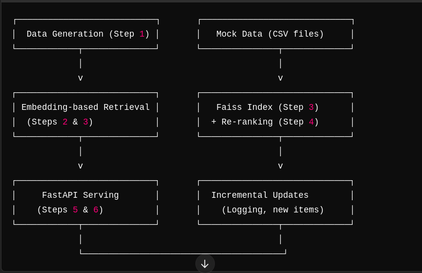

1. **Data** is generated (mocked) and stored locally in CSV files.  
2. We create embeddings for each video and store them in **Faiss** for fast similarity search.  
3. **Real-time** user queries go through a **FastAPI** endpoint, which retrieves top candidates from Faiss, then **re-ranks** them using popularity or other metadata.  
4. We provide endpoints to **log user interactions** and **add new videos** incrementally.  



## Steps

**Step 1**: Mock Data Generation  
- Generates CSV files (`users.csv`, `videos.csv`, `interactions.csv`).  

**Step 2**: Simple Embedding-Based Retrieval  
- Uses **OpenAI** (or local embeddings) to create vector embeddings for each item.  

**Step 3**: Store Embeddings in a **Faiss** Index  
- Builds a local Faiss index for efficient nearest-neighbor searches.  

**Step 4**: Ranking & Re-Ranking  
- Uses metadata (e.g., popularity) to re-rank top candidates from Faiss.  

**Step 5**: Real-Time API Serving  
- Exposes a **FastAPI** endpoint (`POST /recommend`) to serve recommendations.  

**Step 6**: Incremental Updates & Logging  
- Endpoints to **log user interactions** (`POST /log_interaction`) and **add new videos** (`POST /add_video`).  
- Demonstrates how to refresh the Faiss index on the fly.  

**Step 7**: Monitoring, A/B Testing, User Personalization & Scaling  
- Discussion and guidelines for production readiness, advanced user modeling, and large-scale deployments.

---

## Prerequisites

- **Python 3.8+**  
- **Pip** (or Conda) for installing dependencies  
- (Optional) **NVIDIA GPU** (e.g., RTX 2050) if you want local GPU-based inference, but OpenAI embeddings run via the cloud.  

### Python Packages

1. **OpenAI** (for text-embedding-ada-002; or replace with local embeddings)  
2. **numpy**  
3. **pandas**  
4. **faiss-cpu** (or `faiss-gpu` if you want GPU-based Faiss)  
5. **fastapi** + **uvicorn** (for serving the API)  

```bash
pip install openai numpy pandas faiss-cpu fastapi uvicorn
```

## Setup & Usage
## Clone the repository:


```bash 

git clone ... 
cd recommendation-system
```
Install dependencies (e.g., via pip):

```bash 
pip install -r requirements.txt
```
or manually install the listed packages.

## Set OpenAI API Key (if using OpenAI):

```bash 
export OPENAI_API_KEY="YOUR_OPENAI_API_KEY"
```
Or hard-code it in the code (not recommended for production).

## Run Step 1 (Data Generation):

```bash 
python step1_data_pipeline.py
```
This creates mock_data/users.csv, mock_data/videos.csv, mock_data/interactions.csv.
## Run Step 2 (Basic Embeddings) [Optional check]:

```bash 
python step2_embeddings.py
```

Loads videos.csv, embeds, and does a naive similarity search.
## Run Step 3 (Faiss Index) [Optional check]:

```bash 
python step3_faiss.py
```

Builds a Faiss index for the video embeddings and does a test query.
## Run Step 4 (Re-Ranking) [Optional check]:

```bash 
python step4_rerank.py
```
Merges popularity info from interactions, retrieves top candidates from Faiss, and re-ranks them.
## Run Step 5 (API Serving):

```bash 
uvicorn step5_api:app --host 0.0.0.0 --port 8000 --reload
```

Go to http://localhost:8000/docs to see the auto-generated FastAPI docs.
Try POST /recommend.
## Run Step 6 (Incremental Updates):

```bash 
uvicorn step6_incremental:app --host 0.0.0.0 --port 8000 --reload
```
Endpoints:
POST /recommend: get recommendations in real time
POST /log_interaction: increment popularity/watch counts
POST /add_video: add a new video & embed it
(Optional) Explore Step 7 for advanced production strategies:

## Monitoring & Observability
A/B Testing
User-based personalization
Large-scale deployment (Kubernetes, cloud-based vector DB, etc.)
